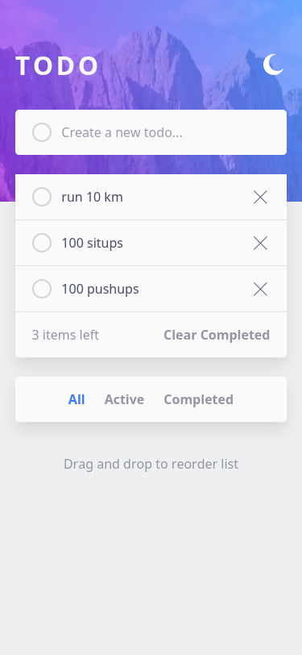

# Frontend Mentor - Todo app solution

This is a solution to the [Todo app challenge on Frontend Mentor](https://www.frontendmentor.io/challenges/todo-app-Su1_KokOW). Frontend Mentor challenges help you improve your coding skills by building realistic projects. 

## Table of contents

- [Overview](#overview)
  - [The challenge](#the-challenge)
  - [Screenshot](#screenshot)
  - [Links](#links)
- [My process](#my-process)
  - [Built with](#built-with)
  - [What I learned](#what-i-learned)
- [Author](#author)

## Overview

### The challenge

Users should be able to:

- View the optimal layout for the app depending on their device's screen size
- See hover states for all interactive elements on the page
- Add new todos to the list
- Mark todos as complete
- Delete todos from the list
- Filter by all/active/complete todos
- Clear all completed todos
- Toggle light and dark mode
- **Bonus**: Drag and drop to reorder items on the list

### Screenshot



### Links

- Solution URL: [github](https://github.com/RadasinR/todo-frontendmentor.git)
- Live Site URL: [vercel](https://todo-frontendmentor-omega.vercel.app/)

## My process

### Built with

- Semantic HTML5 markup
- CSS custom properties
- Flexbox
- CSS Grid
- Mobile-first workflow

### What I learned

Drag and drop.

```js
let ul = document.getElementById("tasksList");

ul.addEventListener("dragover", (event) => {
    const draged = ul.querySelector(".dragging");
    if (draged) {
      const siblings = [...ul.querySelectorAll("li:not(.dragging)")];
      let nextSibling = siblings.find( sib => event.clientY <=  sib.offsetTop + sib.offsetHeight / 2 );
      ul.insertBefore(draged, nextSibling);
    }
});

function drag(li) {
  li.classList.add("dragging");
}

function drop(li) {
  li.classList.remove("dragging");
}

```

## Author

- Frontend Mentor - [@Radasin](https://www.frontendmentor.io/profile/Radasin)
- Twitter - [@xcjvhoaifj](https://twitter.com/xcjvhoaifj)

